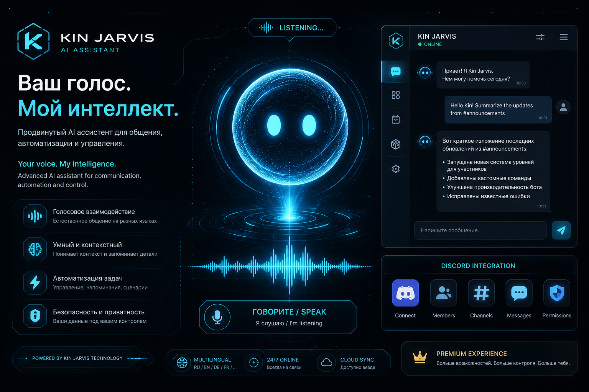

<p align="center">
  
</p>

<h1 align="center">🤖 Kin / Jarvis — AI Assistant</h1>

<p align="center">
  <strong>Персональный голосовой AI-ассистент в стиле JARVIS</strong><br>
  Gemini AI • Голосовое управление • Discord • Автоматизация программ
</p>

<p align="center">
  
  
  
  
</p>

---

## ✨ Возможности

| Функция | Описание |
|---------|----------|
| 🎤 **Голосовое управление** | Непрерывное прослушивание микрофона, распознавание речи |
| 🧠 **Gemini AI** | Умные ответы, понимание контекста, function calling |
| 💬 **Discord** | Открытие чатов по имени с fuzzy matching (нечёткий поиск) |
| 🖥️ **Программы** | Запуск и переключение Discord, Chrome, Steam, Spotify и др. |
| 🔊 **Голосовые ответы** | Edge TTS — естественная речь на русском и английском |
| 🎨 **Красивый UI** | Современный интерфейс в стиле sci-fi / JARVIS |
| 🔐 **Wake Words** | Реагирует только на: **Джарвис, Кин, Jarvis, Астра, Astra** |

---

## 🚀 Быстрый старт

### 1. Клонирование

```bash
git clone https://github.com/KinajUF0/Kin-Jarvis-Assistent.git
cd Kin-Jarvis-Assistent
```

### 2. Установка (Windows)

**Вариант A — BAT (рекомендуется):**

```bat
scripts\install_windows.bat
```

**Вариант B — PowerShell (если BAT выдаёт ошибки кодировки):**

```powershell
powershell -ExecutionPolicy Bypass -File scripts/install_windows.ps1
```

### 3. API Key

1. Получите ключ на [Google AI Studio](https://aistudio.google.com/apikey)
2. Откройте `.env` и вставьте:

```env
GEMINI_API_KEY=ваш_ключ_здесь
```

### 4. Запуск

```bash
scripts\run.bat
```

### 5. Активация

Нажмите **«АКТИВИРОВАТЬ»** и скажите:

> **«Кин, как дела?»**

---

## 🎯 Примеры команд

```
Кин, как дела?                              → Разговор с AI
Джарvis, открой Discord                     → Запуск Discord
Кин, открой в Discord чат с Сэмом           → Fuzzy поиск контакта + DM
Jarvis, open Steam                          → Запуск Steam
Астра, установи громкость 50                → Громкость 50%
Кин, заблокируй компьютер                   → Блокировка экрана
Джарvis, найди рецепт пиццы                 → Google Search
```

> ⚠️ Ассистент реагирует **только** на имена: Джарвис, Кин, Jarvis, Астра, Astra

---

## 💬 Discord — нечёткий поиск контактов

Скажите **«Кин, открой в Discord чат с Сэмом»** — и ассистент:

1. Запустит Discord (или переключится на окно)
2. Найдёт контакт по fuzzy matching: `сэм` → `[S_E_X_Y] Quinsames`
3. Откроет DM через Quick Switcher (Ctrl+K)

### Настройка контактов

`config/contacts.json`:

```json
{
  "display_name": "Сэм",
  "username": "[S_E_X_Y] Quinsames",
  "aliases": ["сэм", "sam", "quinsames", "quins"],
  "quick_switcher_query": "Quinsames"
}
```

📖 Подробнее: [docs/DISCORD.md](docs/DISCORD.md)

---

## 📁 Структура проекта

```
Kin-Jarvis-Assistent/
├── src/
│   ├── main.py              # Точка входа
│   ├── core/
│   │   ├── assistant.py     # Главный оркестратор
│   │   ├── config.py        # Конфигурация
│   │   └── wake_word.py     # Wake word detection
│   ├── ai/
│   │   └── gemini_client.py # Gemini AI + function calling
│   ├── voice/
│   │   ├── listener.py      # Speech-to-Text
│   │   └── speaker.py       # Text-to-Speech (Edge TTS)
│   ├── actions/
│   │   ├── app_launcher.py  # Запуск программ
│   │   ├── discord_handler.py # Discord + fuzzy match
│   │   ├── system_control.py  # Громкость, блокировка
│   │   └── action_router.py   # Маршрутизация действий
│   └── ui/
│       └── app.py           # GUI (CustomTkinter)
├── config/
│   ├── apps.json            # Список программ
│   ├── contacts.json        # Discord контакты
│   └── settings.yaml        # Настройки
├── assets/
│   ├── logo.png             # Логотип
│   └── banner.png           # Баннер
├── docs/
│   ├── SETUP.md             # Подробная установка
│   ├── DISCORD.md           # Discord интеграция
│   └── COMMANDS.md          # Справочник команд
├── scripts/
│   ├── install_windows.bat  # Установка
│   ├── run.bat              # Запуск
│   └── test_components.py   # Тесты
├── .env.example             # Шаблон конфигурации
├── requirements.txt         # Зависимости
└── LICENSE                  # MIT
```

---

## ⚙️ Конфигурация

### `.env` — основные настройки

| Переменная | Описание | По умолчанию |
|------------|----------|--------------|
| `GEMINI_API_KEY` | Ключ Google Gemini | — |
| `GEMINI_MODEL` | Модель AI | `gemini-2.0-flash` |
| `SPEECH_LANGUAGE` | Язык распознавания | `ru-RU` |
| `TTS_VOICE` | Голос TTS | `ru-RU-DmitryNeural` |
| `ASSISTANT_NAME` | Имя ассистента | `Кин` |

### `config/apps.json` — добавление программ

```json
"myapp": {
  "display_name": "Моя программа",
  "process_names": ["myapp"],
  "paths": ["C:\\Path\\To\\app.exe"]
}
```

---

## 🖼️ Скриншот интерфейса

<p align="center">
  
</p>

Интерфейс включает:
- **Боковая панель** — статус, wake words, быстрые действия, Discord контакты
- **Чат** — история сообщений с голосовым и текстовым вводом
- **Справка** — встроенная документация

---

## 🔧 Требования

- **Windows 10/11** (рекомендуется)
- **Python 3.10+**
- **Микрофон**
- **Gemini API Key** ([бесплатно](https://aistudio.google.com/apikey))
- **Discord** (для Discord-команд)

---

## 📖 Документация

| Документ | Описание |
|----------|----------|
| [docs/SETUP.md](docs/SETUP.md) | Подробная установка и решение проблем |
| [docs/DISCORD.md](docs/DISCORD.md) | Discord интеграция и fuzzy matching |
| [docs/COMMANDS.md](docs/COMMANDS.md) | Полный справочник команд |

---

## 🧪 Тестирование

```bash
python scripts/test_components.py
```

Проверяет wake word detection и Discord fuzzy matching.

---

## 🤝 Автор

**Kinaj** ([@KinajUF0](https://github.com/KinajUF0))

---

## 📄 Лицензия

MIT License — используйте свободно!

<p align="center">
  <sub>Сделано с ❤️ для Kinaj</sub>
</p>
